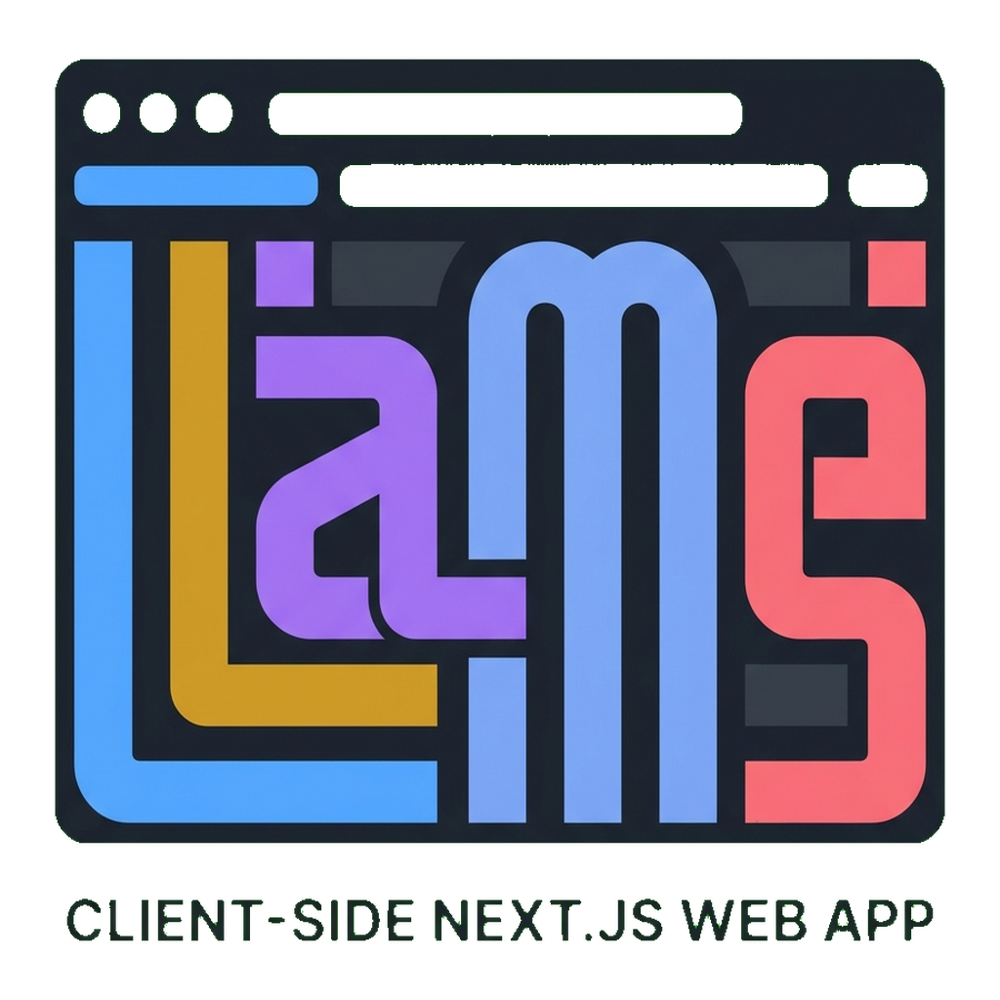

<div align="center">
  

  [](LICENSE) [](https://nextjs.org/) [](https://www.typescriptlang.org/) [](https://llame.tsilva.eu)

  **No Python. No CUDA. No server. Just a URL.**

  **Run private AI models in your browser**

  [Live Demo](https://llame.tsilva.eu)
</div>

## Overview

llame is a fully client-side Next.js app that runs ONNX language models in the browser with [Transformers.js](https://huggingface.co/docs/transformers.js). It uses WebGPU when available, falls back to WASM when needed, and keeps inference on the user's device.

Open the app, pick a model, and chat. There is no backend and no server-side inference.

<div align="center">

| Metric | Value |
|--------|-------|
| Backend | None |
| Runtime | WebGPU (fp16) / WASM (q4) |
| Smallest preset | ~538MB |
| Setup | `npm install && npm run dev` |

</div>

## Features

- In-browser inference in a dedicated Web Worker
- WebGPU acceleration with automatic WASM fallback
- Curated model presets plus an in-app browser for ONNX Community models
- Streaming chat UI with tokens-per-second feedback
- Raw debug view for exact model input and output
- Image input support for vision-capable models
- Tunable generation settings
- Persistent conversations and image attachments in IndexedDB
- Recovery flows for failed or unsupported model loads
- Optional client-side analytics and error reporting that do not send prompts, outputs, or images

## Quick Start

```bash
git clone https://github.com/tsilva/llame.git
cd llame
npm install
npm run dev
```

Open [http://localhost:3000](http://localhost:3000).

## Architecture

```text
src/
├── app/              # Next.js app router
├── components/       # Chat UI, model picker, settings, sidebar
├── hooks/            # Worker lifecycle and storage hooks
├── lib/              # Presets, policies, storage, telemetry, helpers
├── types/            # Worker request/response types
└── workers/          # Inference worker
```

Inference runs inside [`src/workers/inference.worker.ts`](src/workers/inference.worker.ts), with the main thread talking to it through the typed protocol in [`src/types/index.ts`](src/types/index.ts). [`src/hooks/useInferenceWorker.ts`](src/hooks/useInferenceWorker.ts) owns the worker lifecycle and streaming callbacks.

## Supported Models

The app ships with curated, revision-pinned presets and can search additional models from the [ONNX Community](https://huggingface.co/onnx-community).

| Preset | Params | Download |
|--------|--------|----------|
| Qwen3.5 0.8B | 0.8B | ~850MB |
| Qwen3.5 2B | 2B | ~2GB |
| Qwen2.5 0.5B | 0.5B | ~538MB |
| SmolLM3 3B | 3B | ~2.1GB |

Community search results are best-effort and may still fail depending on browser support and device limits.

## Requirements

| Requirement | WebGPU | WASM |
|-------------|--------|------|
| Browser | Chrome 113+, Edge 113+ | Modern browsers |
| GPU VRAM | 2GB+ recommended | N/A |
| RAM | 4GB+ recommended | 4GB+ recommended |
| Precision | fp16 | q4 |

WebGPU is detected automatically. When unavailable, llame falls back to WASM and uses a smaller text preset by default.

## Deployment

llame is built as a static export with `next build --webpack`. Production hosting needs cross-origin isolation headers for `SharedArrayBuffer`; the included [`vercel.json`](vercel.json) sets `Cross-Origin-Embedder-Policy: credentialless` and `Cross-Origin-Opener-Policy: same-origin` along with a CSP that allows Hugging Face model downloads.

ONNX Runtime WASM assets are served from `public/onnxruntime/`, so production does not depend on a third-party CDN for runtime bootstrap files.

Optional env vars:

- `NEXT_PUBLIC_SITE_URL=https://llame.tsilva.eu` for canonical, Open Graph, Twitter, robots, and sitemap URLs
- `NEXT_PUBLIC_GA_MEASUREMENT_ID` for Google Analytics 4
- `NEXT_PUBLIC_ENABLE_VERCEL_INSIGHTS=true` to enable Vercel Analytics and Speed Insights
- `NEXT_PUBLIC_SENTRY_DSN` for client-side Sentry reporting in production

Deploy to Vercel with:

```bash
npm run build
```

## Quality Gates

```bash
npm run lint
npm test
npm run test:e2e
npm run build
npm run smoke
```

[`RELEASE_CHECKLIST.md`](RELEASE_CHECKLIST.md) covers the manual release and device checks.

## Tech Stack

- [Next.js 16](https://nextjs.org/)
- [React 19](https://react.dev/)
- [TypeScript](https://www.typescriptlang.org/)
- [Tailwind CSS 4](https://tailwindcss.com/)
- [Transformers.js](https://huggingface.co/docs/transformers.js)
- WebGPU / WebAssembly

## License

MIT
