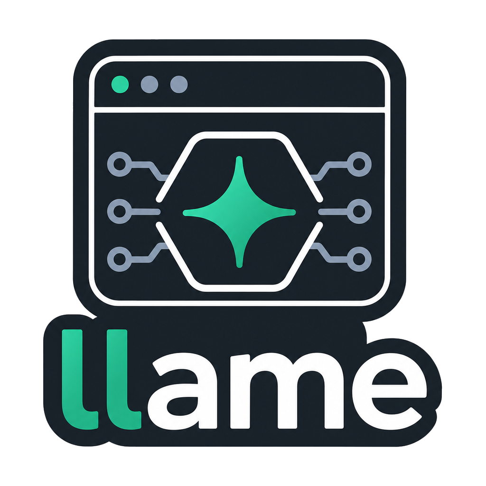
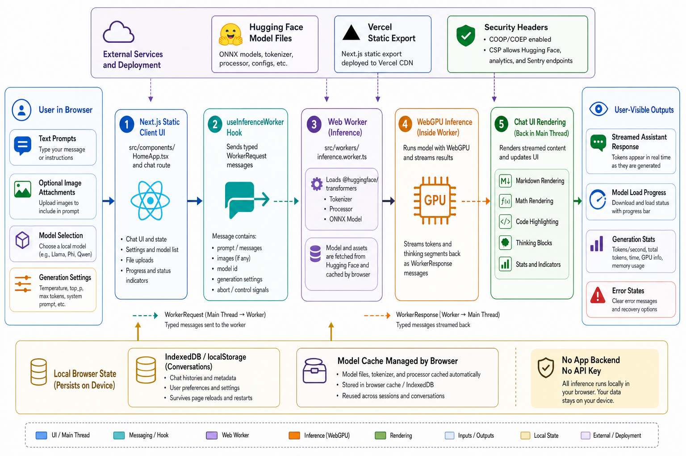

<div align="center">
  

  **Private AI chats in your browser**

  [Live Demo](https://llame.tsilva.eu)
</div>

llame is a fully client-side chat app for running ONNX language and vision models with WebGPU. No backend, no API key, and no hosted inference.

Pick a model, wait for the browser download, and chat locally on your device.
Chat-tuned models use their tokenizer chat template when available. Base causal language models such as GPT-2 run as text-completion models with plain continuation prompts.

## Install

```bash
git clone https://github.com/tsilva/llame.git
cd llame
pnpm install
pnpm dev
```

Open [http://localhost:3000](http://localhost:3000).

## Commands

```bash
pnpm dev      # start local dev server
pnpm build    # build static export
pnpm lint     # run ESLint
pnpm test     # run unit tests
```

## Notes

- This repo enforces pnpm for installs.
- Models are downloaded from Hugging Face into the browser.
- Browser-tested model status lives in `src/config/verifiedModels.ts`; models that load and answer plausibly are marked verified, while known failing presets are marked broken with a reason.
- WebGPU is the supported inference device.
- Conversations, including uploaded images, are stored in IndexedDB, with `llame-` localStorage keys for settings and migration state.
- The Vercel deployment serves a static export with COOP/COEP and CSP headers for browser inference.

## Architecture



## License

[MIT](LICENSE)
