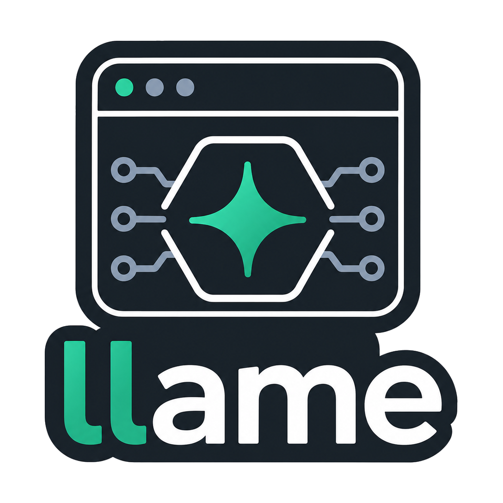
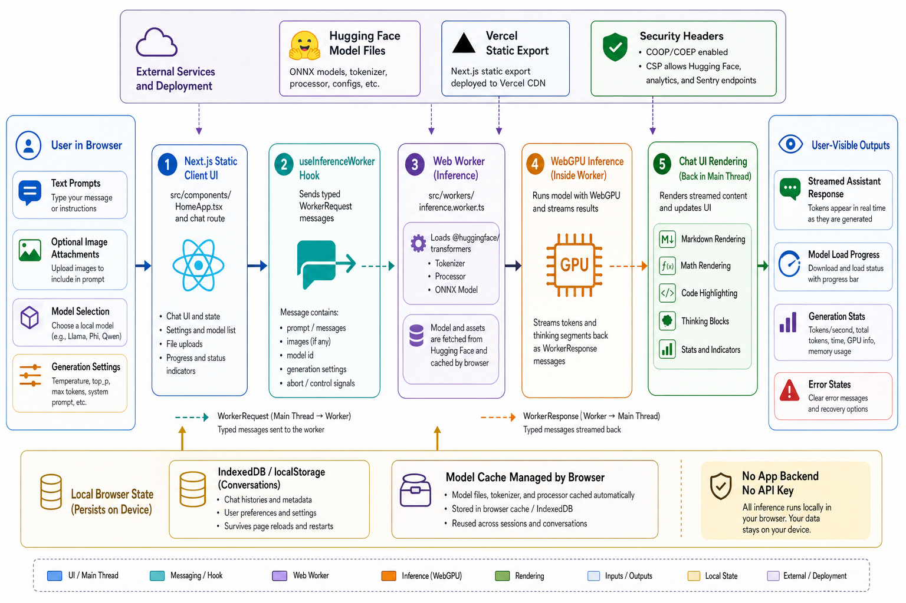

<p align="center">
  
  <br />
  <!-- repo-tagline:start -->
  <strong>💬 Private AI chats in your browser 🔒</strong>
  <!-- repo-tagline:end -->
</p>

**Private AI chats in your browser**

  [Live Demo](https://llame.tsilva.eu)

llame is a fully client-side chat app for running ONNX language and vision models with WebGPU. No backend, no API key, and no hosted inference.

Pick a model, wait for the browser download, and chat locally on your device.
Chat-tuned models use their tokenizer chat template when available. Base causal language models such as GPT-2 run as text-completion models with plain continuation prompts.

## Install

```bash
git clone https://github.com/tsilva/llame.git
cd llame
pnpm install
pnpm dev --port auto
```

Open [http://localhost:3000](http://localhost:3000).

## Commands

```bash
pnpm dev      # start local dev server
pnpm build    # build static export
pnpm lint     # run ESLint
pnpm test     # run unit tests
pnpm run check:verified-model-sitemap
```

## Notes

- This repo enforces pnpm for installs.
- The browser-only inference dependency graph excludes `onnxruntime-node`. Next lint keeps its rules and uses a compatible `tinyglobby` registry alias for project-directory discovery; `pnpm test:dependency-security` verifies both boundaries.
- `pnpm install` configures the repo-managed pre-commit hook in `githooks/`.
- Models are downloaded from Hugging Face into the browser.
- Browser-tested model status lives in `src/config/verifiedModels.ts`; models that load and answer plausibly are marked verified, while known failing presets are marked broken with a reason.
- WebGPU is the supported inference device.
- Tokenization view can colorize the prompt input and visible chat messages after the selected model is loaded, using that model's tokenizer in the inference worker.
- Conversations, including uploaded images, are stored in IndexedDB, with `llame-` localStorage keys for settings and migration state.
- The Vercel deployment serves a static export with COOP/COEP and CSP headers for browser inference.

## Architecture



## License

[MIT](LICENSE)

Production delivery runs on pushes to `main` and supports manual secret rotations. See [production delivery](docs/production-delivery.md) for destinations, access boundaries and failure behavior.
